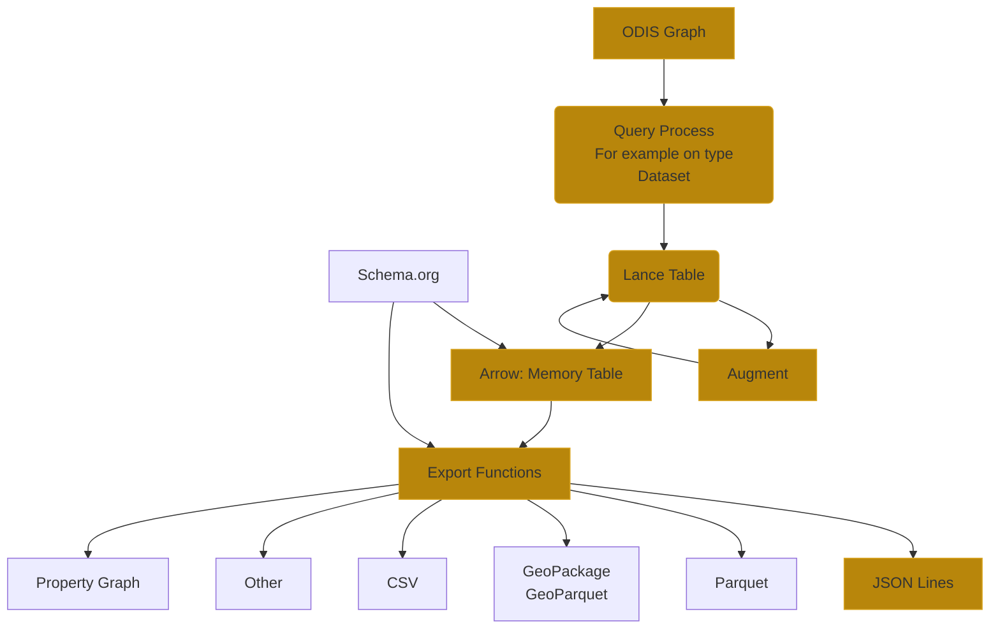

# Product Flow

## Notes 
The export functions generate products.  These products can be augmented with schema.org types and properties.

Also, we can generate metadata for these products, but do not currently, based on:

* ODIS Patterns
* Science on Schema.org
* CDIF Profile
* Croissant Profile

A product plus metadata could be published set if we felt we could address the citation and license elements.  

## Questions
Granularity can be of:

* type 
* provider + type.  

