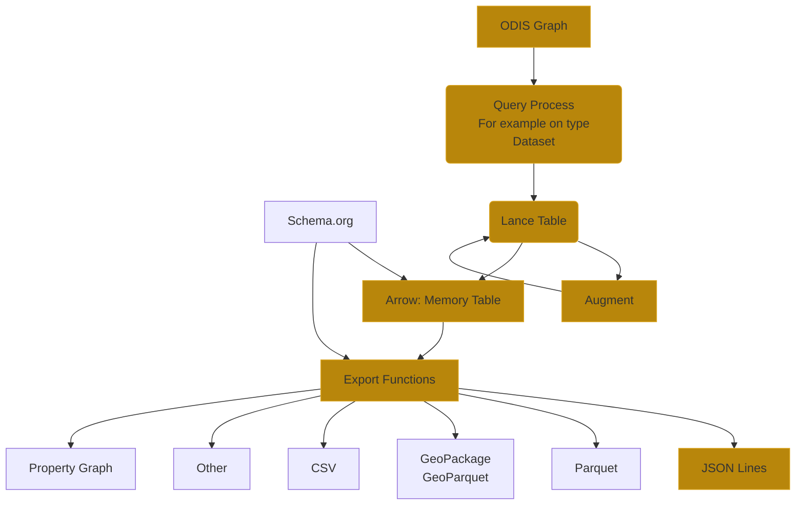

# Product Flow

## Notes 

D3 Partners  

D4 OBIS:

* keyword elements.  (gliner or langextract)
* cruises in certain waters
* NERC:  https://vocab.nerc.ac.uk/
* WORMS use?  (do at class or order level)  https://www.marinespecies.org/
* Agrovoc for fisheries https://www.fao.org/agrovoc/ 
* Gemet  https://www.eionet.europa.eu/gemet/en/themes/
  * https://www.eionet.europa.eu/gemet/en/group/893 

D5 WMO - WIS 2

* Tom WIS2 Spec 
  * What themes of data do you want
    * https://vocab.nerc.ac.uk/collection/P07/current/ 

The export functions generate products.  These products can be augmented with schema.org types and properties.

Also, we can generate metadata for these products, but do not currently, based on:

* ODIS Patterns
* Science on Schema.org
* CDIF Profile
* Croissant Profile

A product plus metadata could be published set if we felt we could address the citation and license elements.  

Need to modify the generation to hold products across the types and providers.

## Questions

Granularity can be of:

The percent coverage for geometry and named entities is what?

* provider, region and type    IHO region (marine regions)
  * Use marine regions from marine regions: https://www.marineregions.org/gazetteer.php?p=details&id=1902 and https://www.marineregions.org/gazetteer.php?p=browser&id[]=1888#focus
  * Check the name mapping table to see what the results there are
  * IOC regions?  
  * Leverage the MRGID  

* file format?  

* type 
* provider + type  

Are SHACL shapes considered products?