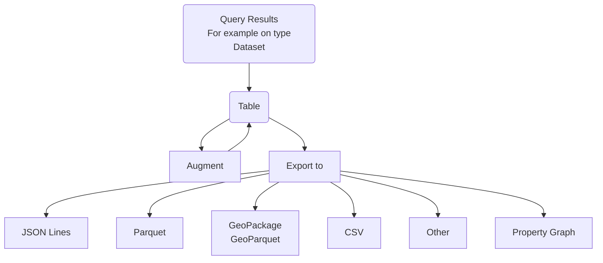

# Product Flow

```mermaid
flowchart TD
    A(Query Results\n For example on type Dataset) --> B(Table)
    C --> B
    B --> C[Augment]
    
    B --> E[Export to]

    E --> K[JSON Lines]
    E --> P[Parquet]
    E --> G[GeoPackage \n GeoParquet]
    E --> CSV[CSV]
    E --> O[Other]
    
    E --> PG[Property Graph]
```

